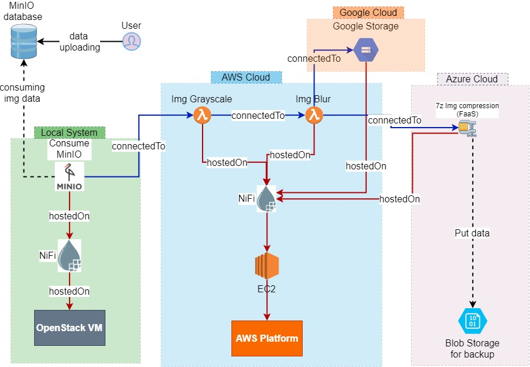

# RADON Data Pipeline Webinar

This repository mainly focuses on demonstration of modeling and orchestration of TOSCA-based data pipeline services using RADON tools.

# What to Demonstrate
We will implement following usecase, where, you upload your image to MinIO bucket as the input. As output, the grayscale and blurred image will be stored in your Google Cloud Storage bucket and the same modified image will be compressed and stored in Azure Blob storage.



*  First phase of the webinar
    *  Open RADON IDE
    *  Short Discussion on Data pipeline pallets
    *  Show the use case figure that will be demonstrated
    *  Create the service template using GMT
    *  Export the service template to IDE
    *  Deploy the service template
    *  Show the data flow
*  Second phase of the webinar
    *  Open the RADON IDE 
    *  Create a service template using GMT with some bugs
    *  Export the service template
    *  Invoke the Data pipeline plugin
    *  Open the modified template using GMT

## Demonstrated Capabilities
This demonstrates following capapabilities of RADON data pipeline.
* Data flow between local premises and cloud 
* Multi-cloud data flow
* Data pipeline and Serverless integration
* No cloud solution vendor lock-in with RADON data pipeline

# 1. System Requirement
* Python v3.6 as the python runtime for Lambda function.
* Python v3.7 for the creating and deploying of the Azure function.


# 2. Prerequisites 
* Cloud configuration 
    * [Azure cloud setup](cloud-configuration/azure)
    * [AWS cloud](cloud-configuration/aws)
    * [Google cloud](cloud-configuration/google) 
* Openstack private cloud
* [Local machine](local-sy-configuration/localMachine.md)
    1. [Docker](local-sy-configuration/docker/docker.md) 
    2. [MinIO setup](local-sy-configuration/minio/minio.md)
    3. [xOpera orchestrator](local-sy-configuration/xopera/xopera.md)

<!-- ## Pre-modelling configurations -->
## 2.1. Gathering & preparing keys/credentials
Note down or prepare following files/keys/credentials
* Google credentials
    * Gather Google credentials to write data to Google storage bucket
    * Go to [Google Service Accounts](https://console.cloud.google.com/iam-admin/serviceaccounts)
    * Select the project
    * Under `Actions` (three dots) -> `Manage keys` -> `Create new key` -> `JSON` -> `CREATE`
    * Now the credential json will be downloaded. Save it somewhere.
* AWS keys 
    * Getting Access Keys
        * Go to IAM service
        * Click on **My access key** under _Quick links_
        * Create a new acess key. You can have at max two access keys.
    * Getting pem key for EC2
        * Go to **EC2** service
        * Under **Network & Secutiry**, click on **Key Pairs**.
        * Create a new one here and download it and save it somewhere.
* Openstack key
    * Get the public key to connect to Openstack VM. Ask you Openstack administrator if you dont find one.


## 2.2. Configuraton of AWS security group 
Make sure you have gone through [this](cloud-configuration/aws/readme.md#configuraton-of-aws-security-group) step.

# 3. Main steps
Now, we will go through following steps:
* Modelling service blueprint with RADON IDE
* Deploying service blueprint
    * using xOpera saas
    * using xOpera CLI 
* Verifying the service dpeloyment

## 3.1 Accessing RADON IDE
Get yourself acquented with the [RADON Integrated Development Environment](https://radon-ide.readthedocs.io/en/latest/). 

Follow below steps to 
* Create an acount [here](http://che-che.51.11.43.6.nip.io/dashboard/)and access RADON IDE 
* Create a RADON workspace ([steps](https://radon-ide.readthedocs.io/en/latest/#create-a-radon-workspace))
* Launch Graphical Modeling Tool ([steps](https://radon-ide.readthedocs.io/en/latest/#id1))

#### If NO access to IDE
If you are unable to get access to IDE, you can create a RADON GMT docker container atop docker engine on your machine.
Here is command to run RADON GMT docker command:
```bash
sudo docker run -it -p 8089:8080 \
    --name radon-gmt \
    -d \
    -e WINERY_FEATURE_RADON=true \
    -e WINERY_REPOSITORY_PROVIDER=yaml \
    -e WINERY_REPOSITORY_URL=https://github.com/chinmaya-dehury/radon-particles \
    opentosca/radon-gmt:latest 
```
Now, access the RADON GMT through your browser using the address ``<ip address>:8089``


## 3.2. **Modelling** service blueprint with RADON IDE
Here, you need to launch the RADON GMT to model your service template in a web graphical interface. 

After that you need to export the modelled service template into a CSAR.   
Here, you can either use the existing CSAR ( modify according to your requirement) OR create a service template from the scratch:
### 3.2.1. Create from scratch
* Please follow these [steps](https://winery.readthedocs.io/en/latest/user/yml/index.html#modeling-an-application) to create a new service template. \
You dont need to model node templates or define relationship between node templates as mentioned in that above-mentioned link.
* In the __Service Template Detail__ view, open the __Topology Modeler__ by clicking on ``Topology Template`` > ``Open Editor`` 
* In the __Topology Modeler__, add the following nodes with properties and artifacts

    |    | Node type                                              | Properties                                                                                                                                                                                    | Artifacts                                                                |
    |----|--------------------------------------------------------|-----------------------------------------------------------------------------------------------------------------------------------------------------------------------------------------------|--------------------------------------------------------------------------|
    | 1  | radon.nodes.VM.OpenStack                               | flavor: m1.medium<br>key_name: <UPDATE HERE><br>image: 13a94b11-98ee-43a4-ad29-00ae97e8f790<br>ssh_username: centos<br>name: NifiHost2-temp<br>network: provider_64_net                       | No artifact needed                                                       |
    | 2  | radon.nodes.aws.AwsPlatform                            | name: AWS<br>region: eu-west-1 <update this if required>                                                                                                                                      | No artifact needed                                                       |
    | 3  | radon.nodes.VM.EC2                                     | image: ami-0b850cf02cc00fdc8<br>ssh_key_name: <UPDATE HERE><br>vpc_subnet_id: <UPDATE HERE><br>instance_type: t2.medium<br>ssh_key_file: { get_artifact: [SELF, keyFile]}<br>ssh_user: centos | name: keyFile<br>type: File<br>file: <upload here EC2 key>               |
    | 4  | radon.nodes.nifi.Nifi                                  | port: 8080<br>webinterface_public: true<br>component_version: 1.13.2                                                                                                                          | No artifact needed                                                       |
    | 5  | radon.nodes.nifi.Nifi                                  | port: 8080<br>webinterface_public: true<br>component_version: 1.13.2                                                                                                                          | No artifact needed                                                       |
    | 6  | radon.nodes.datapipeline.destination.PubGCS | BucketName: <UPDATE HERE><br>cred_file_path: { get_artifact: [SELF, credFile ] }<br>ProjectID: <UPDATE HERE>                                                                                  | name: credFile<br>type: File<br>file: <upload here Google credentials>   |
    | 7  | radon.nodes.datapipeline.process.InvokeLambda          | cred_file_path: { get_artifact: [SELF, credFile]}<br>function_name: img-blur-nifi<br>region: eu-west-1  <update this if required>                                                             | name: credFile<br>type: File<br>file: <upload here AWS credentials>      |
    | 8  | radon.nodes.datapipeline.process.InvokeLambda          | cred_file_path: { get_artifact: [SELF, credFile]}<br>function_name: img-grayscale-nifi<br>region: eu-west-1  <update this if required>                                                        | name: credFile<br>type: File<br>file: <upload here AWS credentials>      |
    | 9  | radon.nodes.datapipeline.process.InvokeImageFaaSFunction | function_URL: < Give your function url > <br> HTTP_method: POST   | No artifact needed |
    | 10  | radon.nodes.datapipeline.source.ConsMinIO              | BucketName: firstbucket<br>cred_file_path: { get_artifact: [SELF, credentials]}<br>MinIO_Endpoint: http://ip.of.your.minioServer:portnumber                                                   | name: credentials<br>type: File<br>file: <upload here MinIO credentials> |
* Now link all the node types as given below.
    * Note: make sure that relationeships/edges are having correct lebels such as `HostedOn`, `ConnectNifiRemote`, and `ConnectNifiLocal`.
Now the service template should look like below figures:

* Now save the service template by clicking on `save` button.
* Once saved, close the  __Topology Modeler__ window.
* Follow the steps [here](https://winery.readthedocs.io/en/latest/user/yml/index.html#export-csar) to export your service template.

### 3.2.2. Reuse the existing CSAR
If you want to reuse the existing CSAR, 
* download [service template](ServiceTemplate) folder 
* make sure that you have modified the following essential properties of tosca nodes in the [radonblueprintsexamples__datapipe-webinar-1.tosca](ServiceTemplate/_definitions/radonblueprintsexamples__datapipe-webinar-1.tosca) file inside ___definitions__ folder.
    * EC2 node
        * Update `ssh_key_name`, `vpc_subnet_id`
        * `image: "ami-0b850cf02cc00fdc8"` is recommended, as this is __centos__ image and this service template is tested on this image.
        * Cross check that `instance_type` is atleast __t2.medium__ and `ssh_user` is __centos__
    * AWS platform node
        * Cross check the `region` properties.
    * Openstack node
        * Update `key_name` properties
    * two Nifi nodes 
        * nothing to update here
        * Just make sure that `component_version` is with the latest Nifi version
    * ConsMinIO
        * Update `MinIO_Endpoint` properties
        * Maybe cross check the `BucketName` properties
    * InvokeLambda for Img_grayscale and Img_watermark 
        * probably need to cross check the `region` properties.
    * InvokeImageFaaSFunction
        * Update `function_URL` properties
    * PubGCS
        * Update `BucketName`, `ProjectID` 

## 3.3. Deploying service blueprint
### 3.3.1. through xOpera SaaS

``In this webinar, we will use only the CLI version of xOpera.``

<!-- 
    In the RADON IDE, make sure you have the csar exported.
    Create a input.yml with following content inside the radon-particles tree
    <details>
        <summary>input.yml</summary>

    ```
    {}
    ```
    </details>

    Before deploying the csar, open the xOpera SaaS to provide your keys and credentials.        
    The keys **openstack-chinmayadehury** and  **ec2-radon-pipeline** should be in 400 permission mode. 
    Following are the different keys and credentials files. 
    **Name** -> **Path** -> **FileMode**   
    openstack-chinmayadehury  ->  /root/.ssh/openstack/openstack-chinmayadehury  -> 400 \
    minio-credentials ->  /root/.ssh/minio/minio-credentials  -> 755 \
    google-cloud-storage  -> /root/.ssh/google/google-cloud-storage  -> 755 \
    ec2-radon-pipeline -> /root/.ssh/ec2/ec2-radon-pipeline -> 400 \
    aws-credentials -> /root/.ssh/aws/aws-credentials -> 755 \ 
-->


### 3.3.2. through xOpera CLI
* Launch the RADON GMT tool from the IDE.
* Go to **Service Templates** tab
* Find and open your service template
* Click on `Export` -> `Download`
* This will download your service template in `csar` format
* Rename the extension of the downloaded service template from `csar` to `zip`
* Unzip the service template

Now go through below steps

### Fixing the service template from potential future errors
* Open the service template (the .tosca file)
* Check if somewhere `"{get_artifact: ....}"` line is within double quote. If so just remove the double quote. 
* e.g. `cred_file_path: "{ get_artifact: [SELF, credFile ] }"` should be changed to `cred_file_path: { get_artifact: [SELF, credFile ] }`

### Configuring EC2 and OpenStack keyFiles
* go to ./servicetemplates/radon.blueprints.example/datapipe-webinar/files/EC2_0/keyFile
* chmod 400 radon-pipeline.pem
__Make sure that other key file for OpenStack Instance (if any) have the same permission.__


### invoke xOpera for deployment: Final Step
* At this stage, it is expected that you have the downloaded the service template


#### Consuming data from MinIO server
Create a credentials file in `/tmp/` directory of the same VM where you will execute the CSAR with opera command.
The content of `credentials` file should be as follows
<details>
      <summary>credentials</summary>

```
[default]
accessKey= MinIO username or the access key
secretKey= your MinIO password or the secret key
```
</details>


# Webinar recorded video
* The recorded video will be released soon on [RADON](https://www.youtube.com/channel/UCgoXX6JZ6bDqTxVBRm4KWnQ) Youtube channel. [Other source](https://tartuulikool-my.sharepoint.com/:v:/g/personal/dehury_ut_ee/EcB-thIDeZlMisl28G49d_kBFfJBkVm82J_FvlMbMkKNgA?e=aIfbNL)    
    
* Extended version of this demo is available [here](https://tartuulikool-my.sharepoint.com/:v:/g/personal/dehury_ut_ee/EYz8vS27HhZFj558JsL4UwMBBb6xB2jX56xZDFb8NjoxAw?e=Hf3eO9)

# Contact Us
To know more about the webinar demonstration, you may write to [Chinmaya Dehury](mailto:chinmaya.dehury@ut.ee)

# Acknowledgement
This project has received funding from the European Union’s Horizon 2020 research and innovation programme under Grant Agreement No. 825040 ([RADON](https://radon-h2020.eu)). 