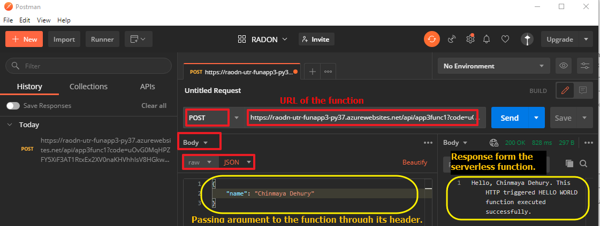

# Azure funcitons
This page focus on manually developing the required Azure function and deploying that one on Azure serverless platform.
Note down the followings:
* _Function App name_: RADON-UTR-FunApp2-Py37
* _Function name_: compress
* _Container name_: first-container-using-py
* _input_: Expecte input format to the Azure function
```json
{
    "blob_name":"name_of_blob_with_extension",
    "data":"base64_encoded_image_data"
}
```
You may test the `compress` funciton with postman app.    
A sample testing screenshot is given below:

