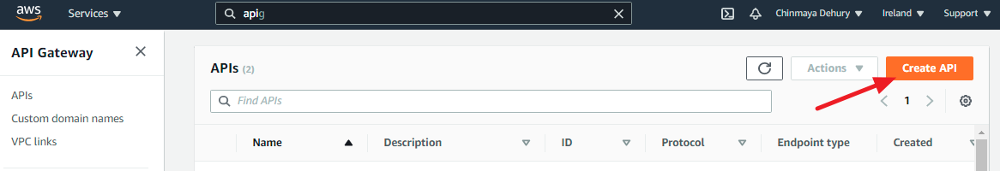
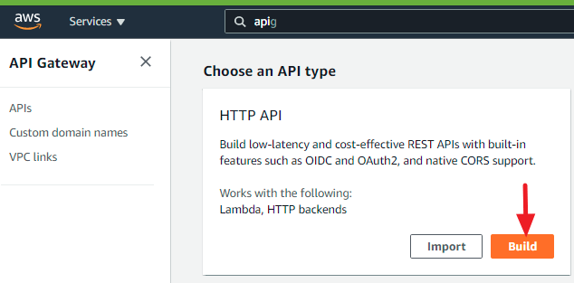

# AWS lambda functions

In this page, we will manually develop the lambda functions required in this webinar.    
Here, we need two functions:
* function to _grascale_ the input image.
* function to _watermark_ the grayscale image.

## Things you should notedown:
* S3 bucket name: radon-utr-webinar-bootcamp
* Region of the lambda functions
* credentials
* Lambda function name
    * img-grayscale-nifi
    * img-watermark-nifi
* Download the [img-grayscale-nifi](functions/img-grayscale-nifi) and [img-watermark-nifi](functions/img-grayscale-nifi) functions and deploy in AWS lambda service.

## Prerequisite (the following steps may not be required)
Add a HTTP API Gateway 
1. Go to API Gateway service : https://eu-west-1.console.aws.amazon.com/apigateway/home?region=eu-west-1
2. Make sure that the required region is selected.
3. Click on `Create API`

4. Now click on `Build` button

5. Give a API Name
6. Configure the routes. You may leave this blank. By doing so, you will be able to add the methods.
7. Configure the stage. This step can also be left as default.
8. Now you should be able to review the configuration. 
9. If all are okay, click on create.

