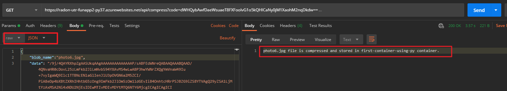

# Azure functions
This page focus on manual development of the required Azure function and deploying that one on Azure serverless platform.
## What this funciton will do?
The `compress` function will 
    receive the base64-encoded image with other metadata -> convert base64 to image format -> compress the image -> than push that compressed image into the given (hard-coded) blob storage. 

The content of the `compress` azure function can be seen below. You can also download only the function code (`compress` folder) from the `/function` folder. You can also download the complete local azure function code (`RADON-UTR-FunApp2-Py37.7z`).  
<details> 
    <summary>__init__.py</summary>

```python
import logging
import base64

import gzip
import azure.functions as func
from azure.storage.blob import BlobServiceClient, BlobClient, ContainerClient, __version__


fileName = ""
fileExtCompress = ".gz"
fileDir = "/tmp/"
# connection string to the storage account
connect_str = "DefaultEndpointsProtocol=https;AccountName=storageaccountnameofradon83f0;AccountKey=NSZ+aGSyRfjM9jCcBQ==;EndpointSuffix=core.windows.net"
my_new_container_name = "first-container-using-py"

def write_to_file(save_path, data):
  with open(save_path, "wb") as f:
    f.write(base64.b64decode(data))

def main(req: func.HttpRequest) -> func.HttpResponse:
    logging.info('Python HTTP trigger function processed a request.')

    img = req.params.get('data')
    if not img:
        try:
            req_body = req.get_json()
        except ValueError:
            pass
        else:
            img = req_body.get('data')

    if img:
        fileName = req.get_json().get('blob_name')

        # Write the base64 data to image file 
               
        write_to_file(fileDir+fileName, img)

        # write the code to compress the image                
        with open(fileDir+fileName, "rb") as file_in:
            # Open output file.            
            with gzip.open(fileDir+fileName+fileExtCompress, "wb") as file_out:
                # Write output in compressed.
                file_out.writelines(file_in)

        # code to write the file to blob storage
        # blob name should be unique        
        blob = BlobClient.from_connection_string(conn_str=connect_str, container_name=my_new_container_name, blob_name=fileName+fileExtCompress)

        
        with open(fileDir+fileName+fileExtCompress, "rb") as data:
            blob.upload_blob(data, overwrite=True)
        
        return func.HttpResponse(f"{req.get_json().get('blob_name')} file is compressed and stored in {my_new_container_name} container.")
    else:
        return func.HttpResponse(
             "This HTTP triggered function executed successfully. Pass a name in the query string or in the request body for a personalized response.",
             status_code=200
        )

```

</details>
Note down the followings:
* **Function App name**: RADON-UTR-FunApp2-Py37
* **Function name**: compress
* **Container name**: first-container-using-py
* **input**: Expected input format to the Azure function
```json
{
    "blob_name":"name_of_blob_with_extension",
    "data":"base64_encoded_image_data"
}
```
You may test the `compress` funciton with postman app.    
A sample testing screenshot is given below:

You can change the argument area acording to your requirement.

### Remark:
* The **storage account connection string** and the **container name** are hard-coded into the `compress` serverless function.
* The function is not tested using the Nifi processor as it is not required at the moment.

# What you need to update before deploying this function
* Go to `__init__.py` file and update following
    * `connect_str`
    * `my_new_container_name`

You may see this blog post to develop and deploy your Azure function.